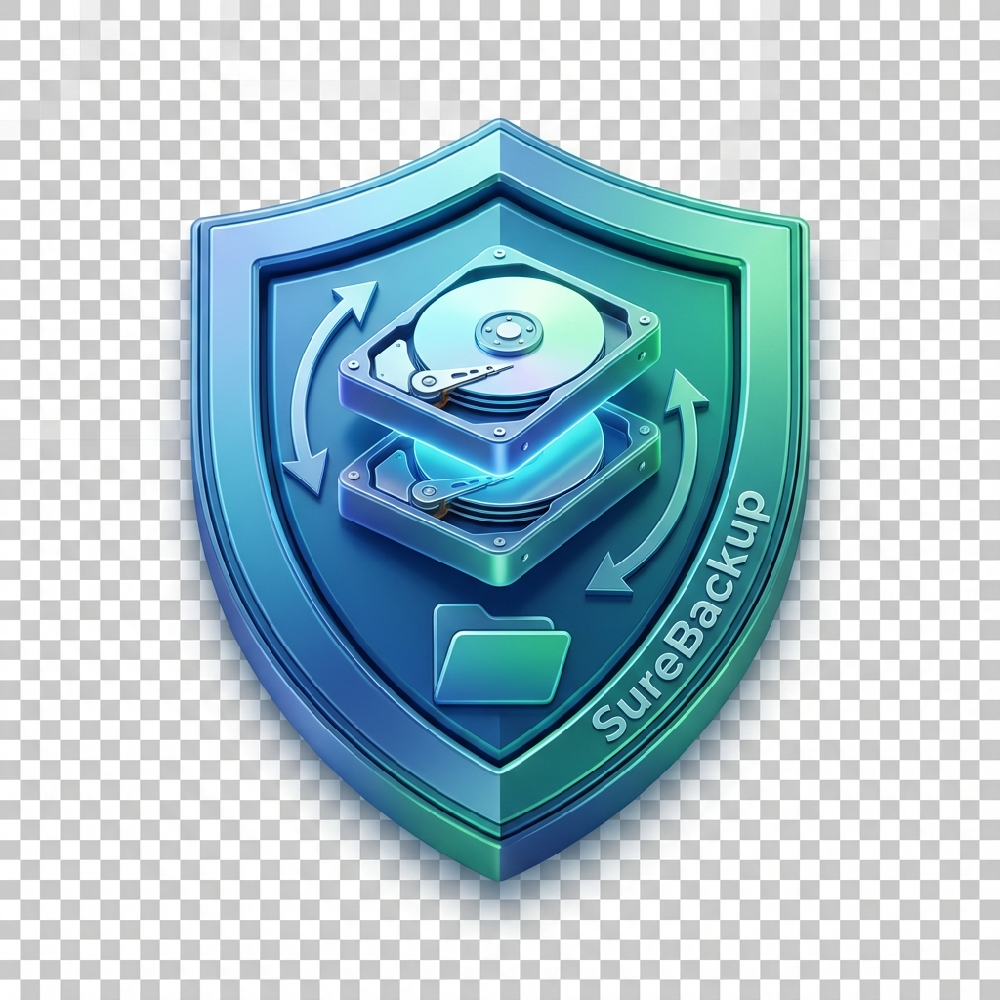
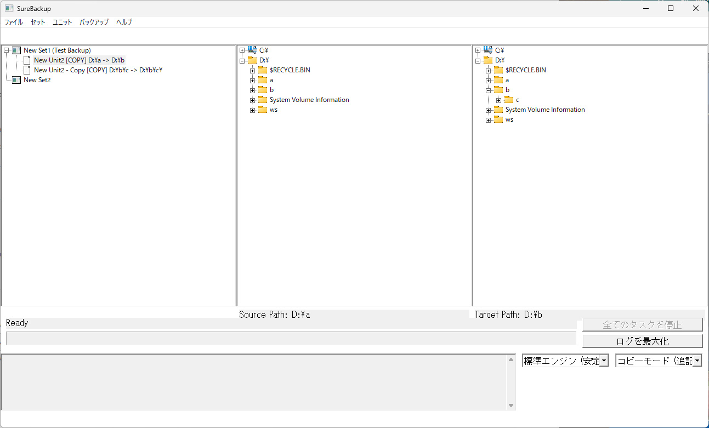

#  SureBackup

[](https://www.microsoft.com/windows)
[](https://en.cppreference.com/w/cpp/17)
[](LICENSE)

**SureBackup** is a professional, native Win32 application designed for robust folder synchronization and data integrity. Built for the Windows environment, it provides a high-performance alternative to generic backup tools, offering bit-perfect mirroring with strict adherence to NTFS file system specifics.



---

## 🚀 Key Features

*   **⚡ Native Performance**: Pure Win32 API implementation for zero-dependency, high-speed execution. No heavy frameworks, just performance.
*   **🏎️ High-Speed Parallel Engine**: Multithreaded backup and synchronization with real-time worker dashboards and aggregate progress tracking.
*   **📂 Advanced NTFS Support**: Full support for **Alternate Data Streams (ADS)** and **Symbolic Links** (files and directories).
*   **🛡️ Bit-Perfect Verification**: Optional 16KB block-level byte-by-byte comparison to ensure data integrity beyond simple timestamp checks.
*   **⏱️ High-Fidelity Metadata**: Strictly preserves file/directory modification and creation times.
*   **🌍 Globalized**: Native support for **English, Japanese, French, German, and Spanish**.
*   **📅 Reliable Scheduling**: Integrated daily/weekly task scheduler with persistence.

## 🛠 Multi-Engine Architecture

SureBackup dynamically selects the optimal strategy for your task:

| Engine | Ideal For | Strategy |
| :--- | :--- | :--- |
| **Standard** | HDD, Network | Sequential processing for maximum stability. |
| **Parallel** | SSD, High-speed LAN | Optimized producer-consumer worker pool. |
| **Comparison** | Audit, Validation | Dedicated bit-level integrity checking. |
| **Experimental** | Advanced Lab | Support for VSS Snapshots and Block Cloning. |

## 🖥 User Interface

*   **Management Tree**: Organize and batch process multiple "Backup Units" grouped into "Backup Sets".
*   **Integrated Explorers**: Quick-select source and target folders using built-in file system discovery trees.
*   **Task Dashboard**: Detailed execution logs with a "Maximize" mode for deep review.
*   **Dynamic Controls**: Change backup modes and engines directly from the main interface.

## 🏗 Build Instructions

### Prerequisites
- Windows 10/11
- Visual Studio (MSVC) with C++17 support
- CMake 3.10+

### Build Steps
```powershell
# Create build directory
mkdir build
cd build

# Configure and generate
cmake ..

# Build the project
cmake --build . --config Release
```

## 📂 Project Structure

- `src/`: Core Win32 application logic and backup engines.
- `src/Strategies/`: Modular implementations of backup/sync strategies.
- `doc/`: Detailed requirements, architecture documentation, and UI mappings.

## 🤝 Acknowledgements

This project was developed through a collaborative effort between the lead developer and **Antigravity (AI)**.

## ⚖ License

This project is licensed under the **MIT License**.

Copyright (c) 2026. All rights reserved.
